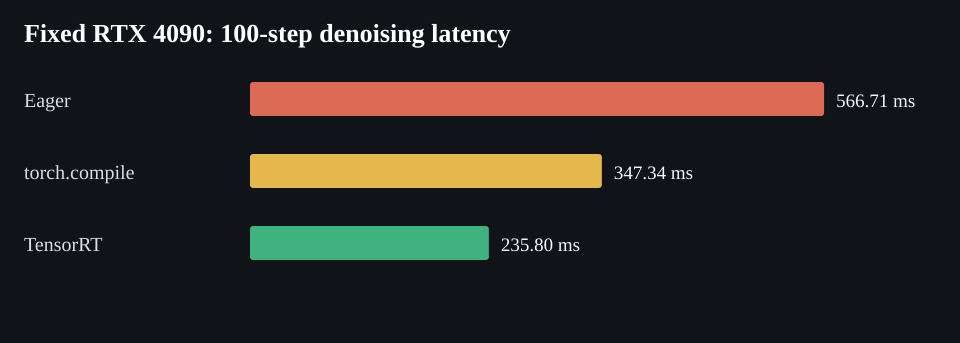
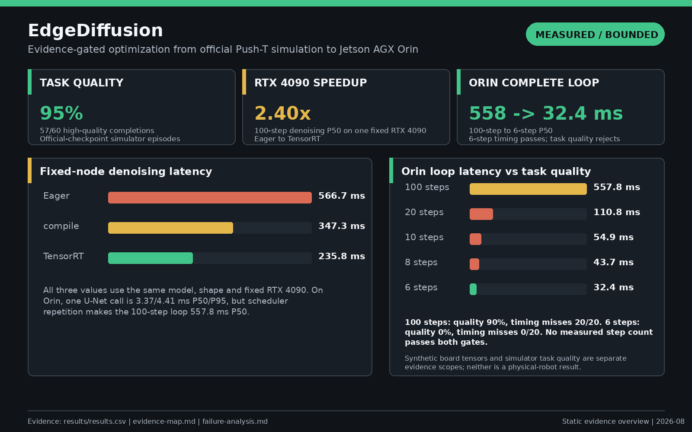
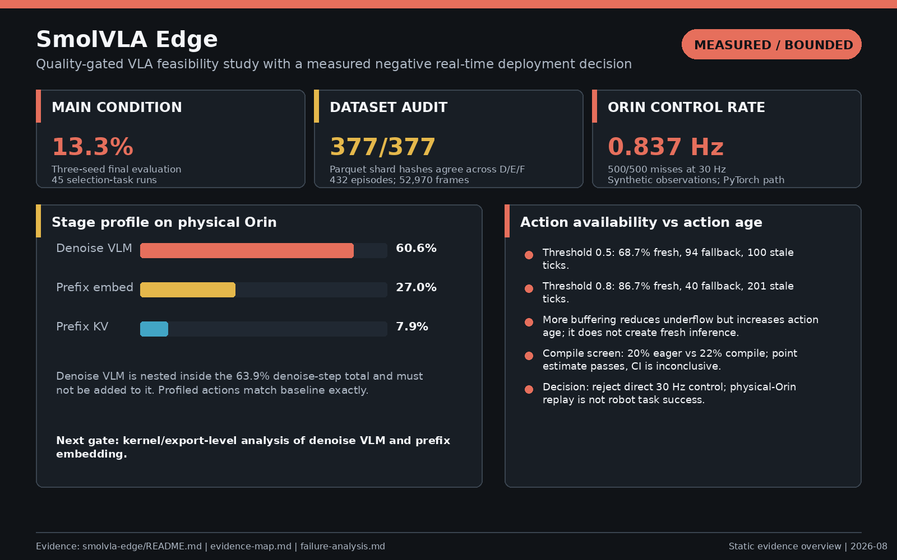
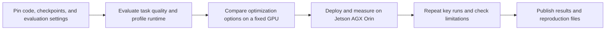

# Edge AI systems portfolio

This project explores a practical question: how far can two robot-learning policies be optimized on an RTX 4090 and then moved to Jetson AGX Orin without losing task quality? It covers official simulator evaluation, GPU profiling and optimization, deployment on a physical Orin board, and reproducible result checks.

For the full methodology and results, see the [Chinese technical report](technical-report-zh.md) or the [English technical report](technical-report.md).



## Results at a glance

| Project | Task result | Systems result | What I concluded |
|---|---|---|---|
| [EdgeDiffusion](projects/edge-diffusion.md) | 95% high-quality completion over 60 Push-T episodes | 2.40x speedup on one RTX 4090; Orin U-Net 3.37/4.41 ms; complete loop 557.8 ms at 100 steps and 32.4 ms at 6 steps | None of the tested step counts met both the Orin timing target and the Push-T quality requirement |
| [SmolVLA edge study](projects/smolvla-edge.md) | 13.3% success on the main condition and 18.1% on the secondary condition | Orin steady chunk 1191.74 ms, 0.837 Hz, and 500/500 misses at 30 Hz | The measured PyTorch path is not suitable for direct 30 Hz control |

For SmolVLA, `torch.compile(reduce-overhead)` reduced first-action P50 by 21.9%, from 1287.54 ms to 1005.55 ms, on fixed synthetic input. A paired 50-episode LIBERO comparison measured 20.0% success with eager execution and 22.0% with compile. The +2.0 percentage-point difference is within the preset +/-5-point screening range, but the 95% confidence interval of [-10.0%, +14.0%] is too wide to establish non-inferiority. The implementation also remains far from 30 Hz.

Stage profiling showed where the time goes: denoise VLM forward accounts for **60.6%** of full Orin inference and prefix embedding for **27.0%**. Raising the scheduler refill threshold increased fresh-action ticks from **68.7%** to **86.7%**, but stale ticks also rose to **201/300**. These results point to kernel or export-level work on the two dominant stages rather than further scheduler tuning alone.

Several apparently promising shortcuts did not hold up under task evaluation:

- Reducing EdgeDiffusion from 100 denoising steps to 20, 10, 8, or 6 made inference faster, but every shorter setting produced 0% high-quality completion in its paired Push-T run.
- Injecting the measured Orin latency range into paired LIBERO runs reduced asynchronous success by 16 and 36 percentage points at refill thresholds 0.5 and 0.8.
- Directly resizing SmolVLA input from 512x512 to 256x256 reduced success from 20.0% to 0.0% on the same 50 episodes.
- A 6000-step, 384x384 LoRA follow-up recovered only 10.0% success, below the preset 15% level for expanding to three seeds and 20k steps.
- Targeted TorchAO INT8 kept action differences within the chosen limits but increased first-action P50 from 1202.12 ms to 1415.67 ms for weight-only and 5450.43 ms for dynamic quantization.

These are simulator and synthetic-input results. They do not demonstrate physical-robot task success. The detailed conditions and source files are linked from the [evidence map](docs/evidence-map.md).

The original dataset records were also cross-checked: three August 4 records agree on **377/377 parquet shard hashes**, 432 selected episodes, and 52,970 frames. Experiments ended by **2026-08-07**. Work on August 8-9 only copied, inventoried, and hash-checked existing files; it did not add new experimental results.

## Visual summaries







## Suggested reading order

1. Read the [EdgeDiffusion](projects/edge-diffusion.md) and [SmolVLA](projects/smolvla-edge.md) summaries.
2. Use the [evidence map](docs/evidence-map.md) to trace any number to its source file.
3. Read the [experiments that did not work](docs/failure-analysis.md) for the engineering tradeoffs.
4. Follow [the offline reproduction instructions](reproduction/README.md) to recalculate the published summary from the included evidence.

## Check the published numbers

The following commands recalculate the summary and verify the included files. They do not rerun model inference.

```bash
cd reproduction/package
docker build --network=none --pull=false -t edge-ai-portfolio-repro .
docker run --rm --network=none --read-only --cap-drop=ALL \
  --security-opt=no-new-privileges edge-ai-portfolio-repro
```

Repository revisions, checkpoint hashes, experimental scope, and known limitations are listed in [provenance.json](reproduction/package/provenance.json). The public repository does not contain model weights, credentials, cloud endpoints, billing data, or private machine paths.
