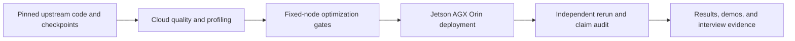

# Edge AI systems portfolio

An evidence-linked systems study spanning official robot-learning baselines, RTX 4090 optimization, and deployment measurements on Jetson AGX Orin. The repository is organized for a technical interview: claims lead to evidence, limitations are explicit, and the frozen aggregation path runs offline.


## Results at a glance

| Project | Task result | Systems result | Engineering decision |
|---|---|---|---|
| [EdgeDiffusion](projects/edge-diffusion.md) | 95% high-quality completion over 60 Push-T episodes | 2.40x RTX 4090 denoising speedup; Orin U-Net 3.37/4.41 ms P50/P95 | Pass the 20 Hz *U-Net-only* timing gate; do not claim full robot-loop latency |
| [SmolVLA edge study](projects/smolvla-edge.md) | 13.3% main / 18.1% secondary-condition success | Orin steady chunk 1191.74 ms, 0.837 Hz, 500/500 misses at 30 Hz | Reject direct 30 Hz control on the measured PyTorch path |



## Review path

1. Read the two project summaries: [EdgeDiffusion](projects/edge-diffusion.md) and [SmolVLA](projects/smolvla-edge.md).
2. Inspect the [claim-to-evidence map](docs/evidence-map.md) and [failure analysis](docs/failure-analysis.md).
3. Open the two 120-second walkthroughs: [EdgeDiffusion](demos/edge-diffusion-evidence-walkthrough.mp4) and [SmolVLA](demos/smolvla-edge-evidence-walkthrough.mp4).
4. Run the frozen, networkless aggregation check described in [reproduction/README.md](reproduction/README.md).
5. Use the [60-question interview bank](docs/interview-qa.md) for progressively deeper discussion.

## Reproduce the published numbers

This verifies frozen evidence aggregation and acceptance gates; it does not rerun model inference.

```bash
cd reproduction/package
docker build --network=none --pull=false -t edge-ai-portfolio-repro .
docker run --rm --network=none --read-only --cap-drop=ALL \
  --security-opt=no-new-privileges edge-ai-portfolio-repro
```

The source repositories, revisions, checkpoint hashes, scopes, and known gaps are recorded in [provenance](reproduction/package/provenance.json). No model weights, credentials, cloud endpoints, billing data, or private machine paths are published here.
