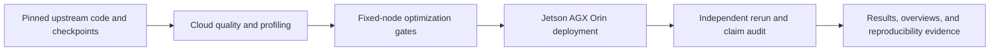

# Edge AI systems portfolio

An evidence-linked systems study spanning official robot-learning baselines, RTX 4090 optimization, and deployment measurements on Jetson AGX Orin. The repository is organized for a technical interview: claims lead to evidence, limitations are explicit, and the frozen aggregation path runs offline.

Read the [complete Chinese technical report](technical-report-zh.md) or the [English technical report](technical-report.md) for the protocol, measured results, scope boundaries, failure analysis and reproduction instructions.


## Results at a glance

| Project | Task result | Systems result | Engineering decision |
|---|---|---|---|
| [EdgeDiffusion](projects/edge-diffusion.md) | 95% high-quality completion over 60 Push-T episodes | 2.40x RTX 4090 speedup; Orin U-Net 3.37/4.41 ms; complete loop 557.8 ms at 100 steps and 32.4 ms at 6 | No step count passes both Orin timing and paired Push-T quality gates |
| [SmolVLA edge study](projects/smolvla-edge.md) | 13.3% main / 18.1% secondary-condition success | Orin steady chunk 1191.74 ms, 0.837 Hz, 500/500 misses at 30 Hz | Reject direct 30 Hz control on the measured PyTorch path |

The supplemental Orin runtime study measured `torch.compile(reduce-overhead)` at 1005.55 ms first-action P50, a 21.9% reduction versus eager. The paired cloud LIBERO screen measured 20.0% eager versus 22.0% compile, a +2.0% paired delta. Its point estimate passes the +/-5 percentage-point rule, but CI [-10.0%, +14.0%] does not establish statistical non-inferiority. The direct 30 Hz deployment claim remains rejected. Full scope and hashes are in [the strengthening evidence](evidence/orin-smolvla-strengthening.json) and [the paired quality evidence](evidence/smolvla-quality-gate.json).

The original dataset evidence is now reconciled: three August 4 audits agree on **377/377 parquet shard hashes**, 432 selected episodes and 52,970 frames. Stage profiling attributes **60.6%** of full Orin inference to denoise VLM forward and **27.0%** to prefix embedding. A physical-Orin scheduler replay increased fresh-action ticks from **68.7%** to **86.7%** when the refill threshold rose, but stale ticks reached **201/300**. See the [dataset audit](evidence/smolvla-dataset-audit.json), [stage profile](evidence/orin-smolvla-strengthening.json), and [scheduler evidence](evidence/orin-smolvla-chunk-scheduler-08.json).

Two additional quality gates retained negative decisions. In the Push-T step sweep, only 100 steps passed; 20/10/8/6 steps reduced controller P50 but each produced 0% high-quality completion and was rejected. In paired LIBERO runs with an injected Orin latency envelope, async success regressed by 16%/36% at thresholds 0.5/0.8. These are simulator gates, not physical-robot results. See [step-count evidence](evidence/edge-step-quality.json) and [latency-envelope evidence](evidence/smolvla-orin-latency-envelope.json).

The frozen SmolVLA visual resize gate is also negative: 512x512 eager achieved 20.0%, while direct 256x256 downsampling achieved 0.0% on the same 50 episode IDs (delta -20.0%); the +/-5 percentage-point gate rejected it. See [resize evidence](evidence/smolvla-resize-quality-gate.json).

A bounded recovery experiment then fine-tuned a 384x384 rank-32 LoRA candidate for 6000 steps. It reached 10.0% versus 20.0% eager on the same 50 paired episode IDs, below the frozen 15% minimum, so the planned three-seed/20k expansion was stopped. See [384px recovery evidence](evidence/smolvla-resize384-finetune-quality-gate.json).

On physical Orin, targeted TorchAO INT8 weight-only/dynamic candidates both passed action-difference limits but regressed first-action P50 from 1202.12 ms eager to 1415.67/5450.43 ms. Both were rejected; this is a synthetic-input runtime result, not a robot-success claim. See [targeted INT8 evidence](evidence/orin-smolvla-quantization.json).

Experiment execution ended by **2026-08-07**. August 8-9 were synchronization, inventory and `verify-only` hash verification only; no new experiments were executed.

## Static evidence overviews




## Review path

1. Read the two project summaries: [EdgeDiffusion](projects/edge-diffusion.md) and [SmolVLA](projects/smolvla-edge.md).
2. Inspect the [claim-to-evidence map](docs/evidence-map.md) and [failure analysis](docs/failure-analysis.md).
3. Open the two static evidence overviews: [EdgeDiffusion](demos/edge-diffusion-evidence-overview.png) and [SmolVLA](demos/smolvla-edge-evidence-overview.png).
4. Run the frozen, networkless aggregation check described in [reproduction/README.md](reproduction/README.md).

## Reproduce the published numbers

This verifies frozen evidence aggregation and acceptance gates; it does not rerun model inference.

```bash
cd reproduction/package
docker build --network=none --pull=false -t edge-ai-portfolio-repro .
docker run --rm --network=none --read-only --cap-drop=ALL \
  --security-opt=no-new-privileges edge-ai-portfolio-repro
```

The source repositories, revisions, checkpoint hashes, scopes, and known gaps are recorded in [provenance](reproduction/package/provenance.json). No model weights, credentials, cloud endpoints, billing data, or private machine paths are published here.
